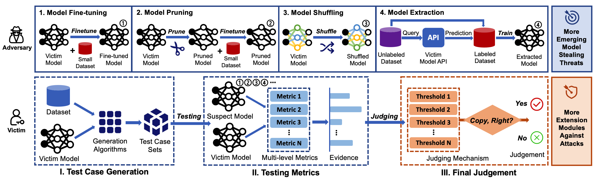

# DeepJudge: Testing for DNN Copyright Protection 
This repository contains code for the conference paper [Copy, Right? A Testing Framework for Copyright Protection of Deep Learning Models](https://arxiv.org/abs/2112.05588) (S&P'22) and the journal extension. 


## Prerequisite (Py3 & TF2) 
The code is run successfully using **Python 3.6.10** and **Tensorflow 2.2.0**. 

We recommend using **conda** to install the tensorflow-gpu environment:

```shell
$ conda create -n tf2-gpu tensorflow-gpu==2.2.0
$ conda activate tf2-gpu
```

To run code in the jupyter notebook, you should add the kernel manually: 

```shell
$ pip install ipykernel
$ python -m ipykernel install --name tf2-gpu
```

## Work Flow


## Files
- `DeepJudge`: Our DeepJudge testing framework.
- `train_models`: train clean models and suspect models.
- `watermarking-whitebox`: a TF2 implementation of [1]. ([Keras version](https://github.com/yu4u/dnn-watermark))
- `watermarking-blackbox`: a TF2 implementation of [2]. 
- `fingerprinting-blackbox`: a TF2 implementation of [3]. 

**Reference:** 

[1] Uchida et al. "Embedding watermarks into deep neural networks." ICMR 2017. 

[2] Zhang et al. "Protecting intellectual property of deep neural networks with watermarking." AisaCCS 2018.

[3] Cao et al. "IPGuard: Protecting intellectual property of deep neural networks via fingerprinting the classification boundary." AsiaCCS 2021.


## To Run

See the `README.md` in each directory. 


## Publication 
```
@inproceedings{deepjudge2022,
  author    = {Jialuo Chen and
               Jingyi Wang and
               Tinglan Peng and
               Youcheng Sun and
               Peng Cheng and
               Shouling Ji and
               Xingjun Ma and
               Bo Li and
               Dawn Song},
  title     = {Copy, Right? A Testing Framework for Copyright Protection of Deep Learning Models},
  booktitle = {43rd IEEE Symposium on Security and Privacy, S&P 2022, San Francisco, CA, USA, May 22-26, 2022},
  year      = {2022},
}
```
<!--
```
@inproceedings{djdemo2023,
  author    = {Jialuo Chen and
               Youcheng Sun and
               Jingyi Wang and
               Peng Cheng and
               Xingjun Ma},
  title     = {DeepJudge: A Testing Framework for Copyright Protection of Deep Learning Models},
  booktitle = {45th IEEE/ACM International Conference on Software Engineering: Companion Proceedings, ICSE 2023, Melbourne, Australia, May 14-20, 2023},
  year      = {2023},
}
```
-->

